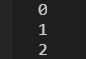
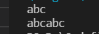
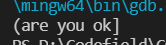

```c
char       //字符型数据
short      //短整型
int        //整形
long       //长整型
long long  //更长的整型
float      //单精度浮点数
double     //双精度浮点数

%d        //打印整形
%c        //打印字符
%f        //打印浮点数字
%p        //打印地址
```


配置自己的代码片段，避免再创新的文件过程中重复写。（创建完，输入pro会自动出现代码界面）

```json
{
	
		// Place your 全局 snippets here. Each snippet is defined under a snippet name and has a scope, prefix, body and 
		// description. Add comma separated ids of the languages where the snippet is applicable in the scope field. If scope 
		// is left empty or omitted, the snippet gets applied to all languages. The prefix is what is 
		// used to trigger the snippet and the body will be expanded and inserted. Possible variables are: 
		// $1, $2 for tab stops, $0 for the final cursor position, and ${1:label}, ${2:another} for placeholders. 
		// Placeholders with the same ids are connected.
		// Example:
		// "Print to console": {
		// 	"scope": "javascript,typescript",
		// 	"prefix": "log",
		// 	"body": [
		// 		"console.log('$1');",
		// 		"$2"
		// 	],
		// 	"description": "Log output to console"
		// }
		"New project template": {
			"prefix": "project_template",
			"body": [
			   "/*************************************************************",
			   "*  FileName:   ${TM_FILENAME}",
			   "*  Date:       ${CURRENT_YEAR}-${CURRENT_MONTH}-${CURRENT_DATE} ${CURRENT_HOUR}:${CURRENT_MINUTE}:${CURRENT_SECOND}",
			   "*  Author:     JAY.Z",
			   "*  Path:       ${TM_DIRECTORY}",
			   "*  Description:$1",
			   "**************************************************************/",
			   "#include <stdio.h> ",
			   "",
			   "",
			   "",
			   "int main ()",
			   "{",
			   "",
			   "",
			   "",
			      "return 0;",
			   "}",
			],
			"description": "c function header template"
	   },
	   "New .c file template": {
			"prefix": "cfile_template",
			"body": [
				"/* include ------------------------------------------------------------------*/",
				"#include ${1:<main.h>}",	//可以根据需要更改
				"\n\n\n/* private define -----------------------------------------------------------*/",
				"\n\n\n/* private variables --------------------------------------------------------*/",
				"\n\n\n/* public function prototype ------------------------------------------------*/",
				"\n\n\n/* private function prototype -----------------------------------------------*/"
				],
			"description": "c source file template"
		},
		"New .h file template": {
			"prefix": "hfile_template",
			"body": [
			   "#ifndef __${TM_FILENAME_BASE}_H_ //shift+U转换为大写",
			   "#define __${TM_FILENAME_BASE}_H_",  //json变量读出的小写不知道怎么转换为大写
			   "\ntypedef struct{",
			   "\t${1:void (_CODE* func)(void);}",
			   "}${2:Class_t};",
			   "\nextern Class_t Class;",
			   "\n\n\n\n\n\n\n\n\n\n#endif"
			],
			"description": "c head file template"
		},
		 "New c function header template": {
			 "prefix": "function_template",
			 "body": [
				"/**",
				"  * @brief  ${1:Desc}",
				"  * @param  ${2:None}",
				"  * @retval ${3:None}",
				"  * @note   ${4:None}",
				"*/",
				"static void ${5:function}(void)",
				"{\n\t$6\n}"
			 ],
			 "description": "c function header template"
		}
	}
	
	

```

#### 常量

- 字面常量

​       示例：3、100无法给它们赋值

- const 修饰的常态量


```c
int main ()
{
 const int n;    //n是变量，但具常属性，但终究是变量
 
 int array[n]={10};

 return 0;
}
```


- #define 定义的标识符常量

- ```c
  #include <stdio.h> 

  #define N 10

  int main ()
  {
   int array[N]={10};   //N就为常量，这样的形式可以
   return 0;
  }
  ```


- 枚举常量

```c
enum Sex
{
    MALE,
    FEMALE,
    SECRET
};

int main ()
{
  enum Sex  s=FEMALE;
  printf("%d\n",MALE);
  printf("%d\n",FEMALE);
  printf("%d\n",SECRET);
  return 0;
}
```



#### 字符串

“hello bit.\n"

这种由双引号引起来的一串字符称为字符串字面值，或者简称字符串。

注：字符串的结束标志是一个\0的转义符，在计算字符串长度\0是结束标志，不算作字符串内容。

```c
int main ()
{
 char arrl[]="abc";
    //"abc"-----'a','b','c','\0'---'\0'字符串结束标志,值为0
 char arr2[]={'a','b','c','\0'};
    //{'a','b','c',0};的形式也可以，0相当于ASCII中'\0',同样可以写56，然后会输出56对应的符号
    //'a','b','c'
 printf("%s\n",arrl);
 printf("%s\n",arr2);
 return 0;
}
//如果arr2[]中去掉’\0'，输出会乱。
```



```c
printf("%d\n",strlen(arrl));
```

strlen--------------计算字符串长度

| 转义字符 |           释义           |
| :--: | :--------------------: |
|  \?  | 在书写连续多个问号使用，防止被解析为三字母词 |
|  \t  |         水平制表符          |
|  \n  |           换行           |
| \ddd | ddd表示1~3个八进制的数字。如：\32  |
| \xdd |  dd表示两个十六进制数字，如：\x30   |

```c
printf("(are you ok??)\n");
//输出结果显然得不到两个问号
```



？？+）------->三字母词

```c
printf("(are you ok\?\?)\n");
//这样就可以了
```

同理，如果想输出一个字符，例如  "

```
printf("%c\n","\"");
```

```c
printf("%d\n",strlen("c:\test\32\test.c"))
//字符串长度为13
//因为\32相当于一个字符，八进制
```

``` c
printf("%c\n",'\x61');
//x61-----表示十六进制-----97-----a
```

#### 数组

C语言给了数组的定义：一组相同类型元素的集合。

#### 循环

continue----------终止本次循环，还要参与到下一个循环

break---------------用于永久终止循环

```c
int i=1;
 while(i<=10)
 {
   i=i+1;
   if(i==5)
     continue;
    printf("%d ",i);
 }
 return 0;
//输出结果为：1 2 3 4 6 7 8  9  10 11
```

```c
 int ret=0;
  int ch=0;
  char password[20]={0};
  printf("请输入密码:>");
  scanf("%s",password);
  while((ch=getchar())!='\n')
  {
    ;
  }
//目的就是为了情空缓冲区，让下面程序正常进行
  ret=getchar();
  if(ret=='Y')
    printf("确认成功\n");
  else
    printf("确认失败\n");
```

清理缓冲区如上

只打印数字字符

```c
int ch=0;
  while((ch=getchar())!=EOF)
   {
     if(ch<'0'||ch>'9')
        continue;
     else
       putchar(ch);
   }
   return 0;
```

#### for循环

for（表达式1；表达式2；表达式3）

表达式1：初始化部分，用于初始化循环变量；表达式2：条件判断，用于判断循环时候终止。表达式3：调整部分，用于循环条件的调整。

建议for语句的循环控制变量的取值采用“前闭后开区间”写法。

#### 题目练习

编写代码，演示多个字符从两端移动，向中间汇聚。

示例：1.welcome to bitte!!!

​            2.#############

代码运行：w#########！

​                    we########!!

​                    ..........................

​                   welcome to bitte!!!

```c
 char arr1[]="welcome to bite!!!";
    char arr2[]="##################";
    int num=(sizeof(arr1)/sizeof(arr1[0]))-2;
    int right=num;
    int left=0;
    while (left<=right)
    {
      arr2[left]=arr1[left];
      arr2[right]=arr1[right];
      left++;
      right--;
      printf("%s\n",arr2);    
      Sleep(1000);//程序运行延迟一秒，对应<windows.h>
      system("cls");//清屏函数，对应<stdlib.h>
    }
```

#### strcmp()函数应用

头文件：string.h

int strcmp(const char* str1,const char* str2);

作用：比较两个字符串是否相等。

返回值：返回值<0,str1<str2;

​               返回值=0，str1=str2;

​               返回值>0,str1>str2;

```c
    int i;
    char password[20]={0};
    for(i=0;i<3;i++)
     {
       printf("输入密码:");
       scanf("%s",password);
       if(strcmp(password,"123456")==0)
       {
         printf("登录成功\n");
         break;
       }
       else
          printf("密码错误\n");
     }
     if(i==3)
         printf("三次密码均错误，退出程序\n");
     return 0;    
```

#### 筛选法求素数

```c
 int arr1[1000];
  for(int i=0;i<1000;i++)
      arr1[i]=0;      //假定都是素数,标记为0
  for(int i=2;i<1000;i++) 
    {
        if(arr1[i-1]==0)
           for(int k=2;k*i<=1000;k++)
              arr1[k*i-1]=1;
    }
   for(int i=1;i<1000;i++)
   {
       if(arr1[i]==0)
         printf("%d  ",i+1);
   }
```

#### 生成随机数

```c
srand((unsigned int)time(NULL));//拿时间戳来设置随机数的生成起始点
//<
//生成随机数种子只用调用一次就行
int ret=rand();//生成随机数
```

#### goto语句，写关机程序

```C
  char input[10]={0};
  system("shutdown -s -t 60");//关机指令，注意空格不要忽略
   again:
        printf("电脑将在1分钟内关机，如果输入:我是猪，就取消关机\n");
        scanf("%s",input);
    if(0==strcmp(input,"我是猪"))   
         system("shutdown -a");
    else
        goto again;     
  system("pause");
```

####库函数

http://www.cplusplus.com/

这个网址可以查询每个库函数的功能。

https://zh.cppreference.com/w/%E9%A6%96%E9%A1%B5

中文网站，可以查阅C语言。

#### 函数的调用

##### 传值调用

形参的修改不改变实参，即交换函数中，传值并不会导致两个数交换。

##### 传址调用

把函数外部创建变量的内存地址传递给函数参数的一种调用函数的方式。

这种传参方式可以让函数和函数外边的变量建立起真正的联系，也就是函数内部可以直接操作函数外部的变量。

#### 链式访问

把一个函数的返回值作为另外一个函数的参数

```c
 printf("%d", printf("%d", printf("%d", 43)));
//printf函数的返回值是打印在屏幕上字符的个数
```

结果为：4321

#### 问题咨询

[Stack Overflow - Where Developers Learn, Share, & Build Careers](https://stackoverflow.com/)

程序员的知乎，可以问问题。

#### 递归

- 存在限制条件，当满足这个限制条件的时候，递归便不再继续


- 每次递归调用之后越来越接近这个限制条件

#### strlen

```c
printf("%u\n",strlen(str));
```

输出为%u，这样就不会报错。

#### 递归求字符串长度

```c
int my_strlen(char *str)
{
  if(*str!='\0')
      return 1+my_strlen(str+1);
  else
       return 0;
}

```

#### 汉诺塔

```c
int i;

void Move(int n,char from,char to)
{
   printf("第%d步:将%d号盘子%c-------->%c\n",i++,n,from,to);
}

void Hanio(int n,char start_pos, char tran_pos,char end_pos)
{
  if(n==1)
      Move(n,start_pos,end_pos);
  else
     {
      Hanio(n-1,start_pos,end_pos,tran_pos);//将n-1个盘子从A移到B(C为过渡）
      Move(n,start_pos,end_pos);//将A底下最大的盘子移到C
      Hanio(n-1,tran_pos,start_pos,end_pos);//将B的n-1个盘子移到C(A为过渡)
     }    
}
```


#### 青蛙跳台阶

```c
int jump(int n)
{
  if(n==1)
     return 1;
  else if(n==2)
     return 2;
  else 
   {
       i=jump(n-2)+jump(n-1);
       return i;
   }   
}
//相当于斐波那契数列
```


#### 数组

数组  []中要给一个常量才可以，不能使用变量。

数组的初始化是指，在创建数组的同时给数组的内容一些合理初始值。


#### if

if语句中不可以break。但是它可以在循环中作为某个if条件下的语句


- sizeof,计算整个数组的大小，sizeof内部单独放一个数组名，数组名表示整个数组

- &数组名，取出的是数组的地址。&数组名，数组名表示整个数组。

  除上述情况外，所有数组名都表示数组首元素的地址。


#### 交换两个整数，不允许使用第三个变量

```c
  a=a+b;
  b=a-b;
  a=a-b;
```


```c
  a=a^b;
  b=a^b;
  a=a^b;
//^异或操作
```

功能一样，但是第一段代码两个数相加存在溢出问题。

#### 找出只出现一次的数

样例：int a[]={1,2,3,4,5,1,2,3,4},该数组中只有5出现一次，其他数字都是成对出现的，要找出5。

```c
 for(int i=0;i<sz;i++)
  {
    int count=0;
    for(int j=0;j<sz;j++)
    {
      if(arry[i]==arry[j])
         count++;
    }
    if(count==1)
       printf("单身狗:%d\n",arry[i]);
  } 
```

暴力求解

```c
  int arry[]={1,2,3,4,5,1,2,3,5,7,4};
  int i=0;
  int ret=0;
  int sz=sizeof(arry)/sizeof(arry[0]);
  for(i=0;i<sz;i++)
   {
     ret=ret^arry[i];
   }
   printf("单身狗:%d\n",ret);
```

异或^求解

#### 三字雷

<game.h>

```c
#ifndef __GAME_H_
#define __GAME_H_

#include <stdio.h>
#include <stdlib.h>
#include <time.h>

#define ROW 3
#define COL 3

//函数声明

//初始化棋盘
void InitBoard(char board[ROW][COL],int row,int col);

//打印棋盘函数
void DisplayBoard(char board[ROW][COL],int row,int col);

//玩家下棋
void PlayerMove(char board[ROW][COL],int row,int col);

//电脑下棋
void ComputerMove(char board[ROW][COL],int row,int col);

/*
   1.玩家赢-------*
   2.电脑赢-------#
   3.平局---------Q
   4.游戏继续-----C
 */

//判断游戏是否输赢
char Iswin(char board[ROW][COL],int row,int col);

#endif

```

<game.c>

```c
#include "game.h"

void InitBoard(char board[ROW][COL],int row,int col)
{
    int i=0;
    int j=0;
    for(i=0;i<row;i++)
    {
        for(j=0;j<col;j++)
        {
            board[i][j]=' ';
        }
    }
}

void DisplayBoard(char board[ROW][COL],int row,int col)
{
    for(int i=0;i<row;i++)
    {
        for(int j=0;j<col;j++)
        {
            printf("  %c  ",board[i][j]);
            if(j<col-1)
               printf("|");
        }
        printf("\n");
        if(i<row-1)
        {
            for(int j=0;j<col;j++)
            {
                printf("_ _ _");
                if(j<col-1)
                   printf("|");
            }
            printf("\n");
        }
    }
}

void PlayerMove(char board[ROW][COL],int row,int col)
{
    int x=0;
    int y=0;

    printf("玩家走:>\n");

    while(1)
    {
        printf("请输入下棋的坐标:>");
        scanf("%d %d",&x,&y);
        //判断坐标合法性
        if(x >= 1 && x <= row && y>= 1 && y <= col)
        {
            //下棋
            //坐标是否被占用
            if(board[x-1][y-1]==' ')
            {
               board[x-1][y-1]='*';
               break;
            }
            else
              printf("坐标被占用，请重新输入\n");
        }
        else
            printf("坐标非法，请重新输入\n");
    }
}

void ComputerMove(char board[ROW][COL],int row,int col)
{
    printf("电脑走:>\n");

    while(1)
    {
        int x = rand() % row;
        int y = rand() % col;

        //判断占用
        if(board[x][y] == ' ')
        {
            board[x][y] = '#';
            break;
        }
    }
}

int isFull(char board[ROW][COL],int row,int col)
{
    int i = 0;
    int j = 0;
    for(i = 0; i<row;i++)
    {
      for(j=0;j<col;j++)
      {
          if(board[i][j]==' ')
             return 0;//棋盘没满
      }
    }
    
    return 1;//棋盘满了
}

char Iswin(char board[ROW][COL],int row,int col)
{
    int i=0;
    //判断三行
    for(i=0;i<row;i++)
    {
        if(board[i][0]==board[i][1]&&board[i][1]==board[i][2]&&board[i][1]!=' ')
            return board[i][1];
    }

    //判断三列
    for(i=0;i<col;i++)
    {
        if(board[0][i]==board[1][i]&&board[1][i]==board[2][i]&&board[1][i]!=' ')
           return board[1][i];
    }

    //判断对角线
    if(board[0][0]==board[1][1]&&board[1][1]==board[2][2]&&board[1][1]!=' ')
       return board[1][1];
    if(board[0][2]==board[1][1]&&board[1][1]==board[2][0]&&board[1][1]!=' ')  
       return board[1][1];

    //判断平局
    //如果棋盘满了返回1，不满返回0    
    int ret=isFull(board,row,col);
    if(ret==1)
      return 'Q';

      //继续
    return 'C';
}
```

<main.c>

```c
#include "game.h"
#include "game.c"

void menu()
{
    printf("*******************************************\n");
    printf("**********      1. play          **********\n");
    printf("**********      0. exit          **********\n");
    printf("*******************************************\n");
}

void game()
{
    char board[ROW][COL];  //存储数据，二维数组
    InitBoard(board,ROW,COL);//初始化棋盘，初始化为空格
    DisplayBoard(board,ROW,COL);//打印一下棋盘，本质是打印数组的内容
    char ret=0;//接受游戏状态
    while(1)
    {
        PlayerMove(board,ROW,COL);//玩家
        DisplayBoard(board,ROW,COL);
        ret=Iswin(board,ROW,COL);//判断玩家是否赢得游戏
        if(ret!='C')
            break;
        ComputerMove(board,ROW,COL);//电脑
        DisplayBoard(board,ROW,COL) ; 
        ret=Iswin(board,ROW,COL);
        if(ret!='C')
            break;
    }
    if(ret=='*')
        printf("玩家赢了\n");
    else if(ret=='#')
        printf("电脑赢了\n"); 
    else  
        printf("平局\n");
    DisplayBoard(board,ROW,COL);       
}

int main()
{
    int input=0;
    srand((unsigned int)time(NULL));

    do
    {
        menu();
        printf("请选择:>");
        scanf("%d",&input);
        switch(input)
        {
            case 1:
                game();
                break;
            case 0:
                printf("退出游戏\n");
                break;
            default:
                printf("选择错误，重新选择\n");
                break;    
        }
    } while (input);

    return 0;
}
```

#### 扫雷

<game2.h>

```c
#ifndef __game2_H_
#define __game2_H_

#include <stdio.h>
#include <stdlib.h>
#include <time.h>

#define EASY_COUNT 10

#define ROW 9
#define COL 9

#define ROWS ROW+2
#define COLS COL+2

//初始化棋盘
void InitBoard(char boaed[ROWS][COLS], int rows, int cols, char set);

//打印棋盘
void DisplayBoard(char board[ROWS][COLS], int row, int col);

//布置雷
void SetMine(char mine[ROWS][COLS], int row, int col);

//排查雷
void FindMine(char mine[ROWS][COLS], char show[ROWS][COLS], int row, int col);

#endif
```

<game2.c>

```c
#include "game2.h"

void InitBoard(char board[ROWS][COLS],int rows,int cols,char set)
{
    for (int i = 0; i < rows;i++)
       for (int j = 0; j < cols;j++)
           board[i][j] = set;
}

void  DisplayBoard(char board[ROWS][COLS],int row,int col)
{
    printf("------------扫雷游戏-------------\n");
    //打印列号
    for (int i = 0; i <= col;i++)
    {
        printf("%d ", i);
    }
    printf("\n");
    for (int i = 1; i <= row;i++)
    {
        printf("%d ", i);
        for (int j = 1; j <= col; j++)
        {
            printf("%c ", board[i][j]);
        }
        printf("\n");
    }
    printf("-------------扫雷游戏---------------\n");
}

void SetMine(char mine[ROWS][COLS],int row,int col)
{
    //布置10个雷
    int count = EASY_COUNT;
    while(count)
    {
        //生产随机的下标
        int x = rand() % row + 1;
        int y = rand() % col + 1;
        if (mine[x][y] == '0')
        {
            mine[x][y] = '1';
            count--;
        }
    }
}

//'3'- '0'=3
static int get_mine_count(char mine[ROWS][COLS],int x,int y)
{
    return mine[x - 1][y] +
           mine[x - 1][y - 1] +
           mine[x][y - 1] +
           mine[x + 1][y - 1] +
           mine[x + 1][y] +
           mine[x + 1][y + 1] +
           mine[x][y + 1] +
           mine[x - 1][y + 1] - 8 * '0';
}

void FindMine(char mine[ROWS][COLS],char show[ROWS][COLS],int row,int col)
{
    //1.输入排查的目标
    //2.检查坐标处是不是雷
      //(1)是雷  -  很遗憾被炸死    -  游戏结束
      //(2) 不是雷   -统计坐标周围有几个雷      - 存储排查雷的信息到show数组，游戏继续

    int x = 0;
    int y = 0;
    int win = 0;

    while(win<row*col-EASY_COUNT)
    {
        printf("请输入要排查的坐标:>");
        scanf("%d%d",& x, &y);

        //判断坐标的合法性
        if(x >= 1&& x <= row && y>=1 && y<= col)
        {
           if(mine[x][y]=='1')
           {
               printf("很遗憾，你被炸死了\n");
               DisplayBoard(mine, row, col);
               break;
           }
           else{
               //不是雷的情况下，统计x,y坐标周围有几个雷
               int count = get_mine_count(mine, x, y);
               show[x][y] = count + '0';
               //显示排查出的信息
               DisplayBoard(show, row, col);
               win++;
           }
        }
        else
            printf("坐标不合法，请重新输入\n");
    }

     if(win==row*col-EASY_COUNT)   
     {
         printf("恭喜你，排雷成功\n");
         DisplayBoard(mine, row, col);
     }
}
```

<test.c>

```c
#include "game2.h"
#include "game2.c"

void menu()
{
    printf("******************************\n");
	printf("******    1. play      *******\n");
	printf("******    0. exit      *******\n");
	printf("******************************\n");
}

void game()
{
    char mine[ROWS][COLS] = {0};//存放布置好的雷的信息
    char show[ROWS][COLS] = {0};//存放排查出的雷的信息
    //初始化棋盘
    InitBoard(mine, ROWS, COLS, '0');//'0'
    InitBoard(show, ROWS, COLS, '*');//'*'

    //打印一下棋盘
    DisplayBoard(show, ROW, COL);

    //布置雷
    SetMine(mine, ROW, COL);

    //排查雷
    FindMine(mine, show, ROW, COL);
}

int main()
{
    int input = 0;
    srand((unsigned int)time(NULL));

    do
    {
        menu();
        printf("请选择:>");
        scanf("%d", &input);
        switch(input)
        {
            case 1 :
                game();//扫雷游戏
                break;
            case 0 :
                printf("退出游戏\n");
                break;
            default :
                printf("选择错误，重新选择\n");
                break;
        }
    } while (input);
    return 0;
}
```

#### 操作符

原码:最高位为符号位,正数为0,负数为1.

存储到内存的是补码,正数的原码.反码.补码是相同的.

负数的反码是在原码的基础上,符号位不变,各个位求反.

负数的补码是在反码的基础上加1.

异或,相同位0,相异为1.

##### 移位操作符

> > 右移操作符 >>
> >
> > 左移操作符 <<

1.算术右移

​    右边丢弃,左边补原符号位

2.逻辑右移

​     右边丢弃,左边补0

对于移位运算符,不要移动负数位,这个标准未定义.

##### 位操作符

&       //按位与

|        //按位或

^        //按位异或

注:操作数必须是整数.


##### 求一个整数存储在内存中的二进制中1的个数

```c
  int count = 0;
  for (int i = 0; i < 32;i++)
  {
    if((num&1)==1)
    {
      count++;
    }
   num= num >> i;
  }
//算法:每个数与1,补码最后一位为1,那么都为1,因而可以判断每个补码的最后一位
```

改进

```c
 while(num)
  {
    count++;
    num = (num) & (num - 1);//每次去掉一位1,1都没了,就成0
  }
```

```c
  int i = 0, a = 1, b = 2, c = 3, d = 4;
  i = a++ && ++b && d++;
  printf("a = %d\n b = %d\n c = %d\n d = %d\n", a, b, c, d);
//输出结果：2 3 3 5
```

```c
  int i = 0, a = 1, b = 2, c = 3, d = 4;
  i = a++ || ++b || d++;
  printf("a = %d\n b = %d\n c = %d\n d = %d\n", a, b, c, d);
//输出结果： 2 2 3 4
```

##### 条件操作符

exp1 ? exp2 : exp3

```c
if(a>5)
  b=3;
 else
   b=-3;
//上面为常规表达，下面为三目操作符
int b=(a>5 ? 3:-3);
```

##### 逗号表达式

exp1,exp2,exp3，…expN

逗号表达式，就是用逗号隔开的多个表达式

逗号表达式，从左向右依次执行。整个表达式的结果就是最后一个表达式的结果。

```c
a = get_val();
count_val(a);
while(a>0)
{
  //业务处理
  a = get_val();
  count_val(a);
}

//如果用逗号表达式，改写：
while(a = get_val(), count_val(a),a>0)
{
            //业务处理
}
```

#### 指针

指针就是地址，口语中的指针通常指的是指针变量。

我们可以通过&（取地址符）取出变量的内存起始地址，把地址可以存放到一个变量中，这个变量就是指针变量。

```c
int a = 10;//在内存中开辟一块空间
int* p = &a;//我们对变量a，取出它的地址，可以用&操作符
//a变量占用4个字节的空间，这里将a的4个字节的第一个字节的地址存放在p变量中，p就是一个指针变量
```

指针变量，就是存放地址的变量。(存放在指针中的值都被当成地址处理)。

指针的大小在32位平台是4个字节，在64位是8个字节。


指针类型决定了指针进行解引用操作的时候，能够访问空间的大小

int* p :       *p能够访问4个字节

char* p：     *p能够访问1个字节

double* p：   *p能够访问8个字节


指针的类型决定了指针向前或者向后走一步有多大（距离）。

##### 野指针

野指针就是指针指向的位置是不可知的（随机的、不正确的、没有明确限制的）

原因：

- 指针未初始化

  ```c
  int* p；//局部变量指针未初始化，默认为随机值
  *p = 20；
  ```


- 指针越界访问

  ```c
  int arr[10] = {0};
  int* p = arr;
  int i = 0;
  for(i = 0; i <= 11; i++)
     {
     //当指针指向的范围超出数组arr的范围时，p就是野指针
     *（p++）= i；
     }
  ```


- 指针指向的空间释放

  ```c
  int* test()
  {
    int a = 10;
    return &a;
  }

  int main()
  {
    int* p = test();//test函数调用完就释放内存
    *p = 20;
  }
  ```

  避免野指针

  1.指针初始化

  2.小心指针越界

  3.指针指向空间释放即设置NULL；

  4.避免返回局部变量的地址

  5.指针使用之前检查有效性


```c
int my_strlen(char* str)
{
  char *start = str;
  char* end = str;
  while(*end!='\0')
  {
    end++;
  }
  return end - start;
}
```


指针的关系运算

```c
for(vp = &values[N_VALUES-1]; vp>=&values[0];vp--)
   *vp = 0 ;
```

实际在绝大部分的编译器上是可以顺利完成任务的，然而我们还是应该避免这样写，标准并不保证可行。

标准规定：

  允许指向数组元素的指针与指向数组最后一个元素后面的那个内存位置的指针比较，但是不允许与指向第一个元素之前的那个内存位置的指针进行比较。


指针数组是数组，存放指针的数组。


在函数体内部(main函数除外)不能用sizeof求数组的长度，因而涉及到长度，要在函数中多加一个传入的参数。


#### 结构体

```c
//struct 结构体关键字   Stu - 结构体标签     struct Stu - 结构体类型
struct Stu
{
  //成员变量
  char name[20];
  short age;
  char tele[12];
  char sex[5];
}s1,s2,s3;//s1,s2,s3是三个全局的结构体变量

int main()
{
  struct Stu s;//局部变量
}
```

```c
typedef struct Stu//typedef 相当于起别名
{
  //成员变量
  char name[20];
  short age;
  char tele[12];
  char sex[5];
}Stu;//stu就是结构体类型

int main()
{
   Stu s;//
}
```

结构体传参的时候，要传结构体的地址。

```
printf(s);
printf(&s);
```

| 栈区：1.局部变量    2.函数的形式参数   3.函数调用开辟空间      |
| ---------------------------------------- |
| 堆区： 1.动态内存分配   2.malloc/free 3.realloc 4.calloc |
| 静态区：1.全局变量  2.静态变量                       |

#### const

```c
const int* p//const 放在指针变量的*左边，修饰*p，不能通过p来改变*p（num）的值
int* const p //放在右边，修饰的是指针变量p本身，p不能被改变
```

#### 编码规范

##### 优秀的代码

1.代码运行正常

2.bug很少

3.效率高

4.可读性高

5.可维护性高

6.注释清晰

7.文档齐全

##### 常见的coding技巧

1.使用assert

2.尽量使用const

3.使用良好的编码风格

4.添加必要的注释

5.避免编码的陷阱

```c
char* strcpy(char* dst,const char* src)
{
  char* cp=dst;
  assert(dst&&src);
  
  while(*cp++ = *src++)
  {
    ；
  }
  
  return dst;
}
```

#### assert

```c
#include <assert.h>
//检查指针是否为空指针，如果为空，会报错，不为空，继续使用。
```


#### 大小端

1--------0x00 00 00 01

大端：00 00 00 01

小端：01 00 00 00

##### 设计一个小程序判断当前机器的字节序

```c
int check_sys()
{
  int i = 1;
  char *p = (char*)&i;//转变指针类型，目的是求1个字节的数是多少
  return *p;
}
//改进一下
int check_sys()
{
  int i = 1;
  
  return *(char*(&i));
}
//指针类型的意义
//1.指针类型决定了指针解引用操作符能访问几个字节：char *p；*p访问了1个字节，int*p，*p访问四个字节
//2.指针类型决定了指针+1，-1加的或者减的是几个字节：char*p;p+1跳过1个字符，int*p，p+1跳过一个整形，4个字节。
```

#### char * 指针

```c
char arr1[]="abcdef";
char arr2[]="abcdef";
char* p1="abcdef";
char* p2="abcdef";
//arr1[]和arr2[]占据的两个不同内存，无法比较大小
//*p1和*p2占据的同一内存，即二者相同。
```

```c
int arr[10]={1,2,3,4,5,6,7,8,9,10};
int (*p)[10]=&arr;//数组的地址要存起来
//上面的p就是数组指针
//[]的优先级要比*高，所以用括号括起来。
```

#### 数组传参

一维数组

```c
void test(int arr[])
void test(int arr[10])
void test(int *arr)
void test2(int *arr[20])
void test2(int **arr);
int main()
{
  int arr[10]={0};
  int *arr2[20]={0};
  test(arr);
  test2(arr2);
}
```

二维数组传参

```c
void test(int arr[3][5])
void test(int arr[][5])
void test(int (*arr)[5])
int main()
{
  int arr[3][5]={0};
  test(arr);
}
```

#### 数组指针

```c
char* arr[5];
char* (*pa)[5]=&arr;
//pa---指针变量的名字  *----pa是指针   char*----pa指向的数组的元素类型是char*
//[5]----pa指向的数组是5个元素的char*

int arr2[10]={0};
int (*pa2)[10]=&arr2;

int arr[10] = {1, 2, 3, 4, 5, 6, 7, 8, 9, 10};
int (*p)[10] = &arr;
for (int i = 0; i < 10;i++)
  {
   // printf("%d ", (*p)[i]);
   //printf("%d ",*(*p+i));
  }

```

```c
void print1(int (*p)[5],int x,int y)
{
  for (int i = 0; i < x;i++)
  {
    for (int j = 0; j < y;j++)
    {
       printf("%d ",p[i][j]);
      //-----------------------------
      //printf("%d ",*(p[i]+j));
      //printf("%d ", *(*(p+i)+j));
      //-----------------------------
      //printf("%d ", (*(p + i))[j]);
      //上面五种输出方式都可以
    }
    printf("\n");
  }
}
int main ()
{
  int arr[3][5] = {{1, 2, 3, 4, 5}, {2, 3, 4, 5, 6}, {3, 4, 5, 6, 7}};
  print1(arr, 3, 5);
}
```

```c
int arr[5];         //arr是一个5个元素的整形数组
int *parrl[10]      //parr1是一个数组，数组有10个元素，每个元素的类型是int*，parrl是指针数组
int (*parr2)[10]    //parr2是一个指针，该指针指向了一个数组，数组有10个元素，每个元素的类型是int-parr2是数组指针
int (*parr3[10])[5] //parr3是一个数组，该数组有10个元素，每个元素是一个数组指针，该数组指针指向的数组有5个元素，每个元素是int
```

```c
  int *p = &n;
  int **pp = &p;
  test(pp);
  test(&p);

 void test(int** ptr)
{
  printf("num=%d\n", **ptr);
}
//二级指针调用
```

#### 函数指针

函数指针------------指向函数的指针

&函数名 和 函数名 都是函数的地址

```c
int  (*pa)(int,int)=Add;
*pa(2,3);//调用函数指针
```

```c
(*(void(*)())0)();//把0强制类型转换成： void(*)()函数指针类型-0就是一个函数地址
//调用0地址处的该函数

void (*signal(int,void(*)(int)))(int);
//signal是一个函数声明
//signal函数的参数有2个，第一个是int，第二个是函数指针，该函数指针指向的函数的参数是int，返回类型是void
//signal函数的返回类型是一个函数指针：该函数指针指向的函数的参数是int，返回类型是void

typedef void(*pfun_t)(int);//重命名的形式与其他不同，pfun_t就是一个类型
pfun_t signal(int,pfun_t);
//这两个语句等价于第4行代码
```

函数指针的数组

```c
int (*parr[4])(int,int)={Add,Sub,Mul,Div};
```

```c
char* my_strcpy(char* dest,const char* src);
//写一个函数指针pf,能够指向my_strcpy
char*(*pf)(char*,const char*)
 //写一个函数指针数组pfArr，能够存放4个my——strcpy函数的地址
  char* (*pf)(char *,const char*)
```

```c
int (*pfArr[4])(int,int);//pfArr是一个数组-函数指针的数组
int(*(*ppfArr)[4])(int,int)=&pfArr;//ppfArr是一个数组指针，指针指向的数组有4个元素
//指向的数组的每个元素的类型是一个函数指针 int(*)(int,int)
```

#### 回调函数

```c
void print(char *str)
{
  printf("hehe:%s",str);
}

void test(void(*p)(char*))
{
  printf("test\n");
  p("bit");
}
```

#### qsort函数使用

```c
void qsort( void *base, size_t num, size_t width, int (__cdecl *compare )(const void *elem1, const void *elem2 ) );
//库函数

base

Start of target array //目标数组的开始

num

Array size in elements//数组大小

width

Element size in bytes//元素大小（字节）

compare

Comparison function //比较功能

elem1

Pointer to the key for the search

elem2

Pointer to the array element to be compared with the key

```

```c
//void* 类型的指针 可以接收任意类型的地址
int a=10; 
void* p=&a;
//char *p=&a;这样类型不可以
//void* 类型的指针 不能进行解引用操作
//*p=0；这样就不行，p是void*类型
//void* 类型的指针 不能进行+-整数的操作
```

```c
#include <stdio.h> 
#include <stdlib.h> 

 struct stu
    {
        char name[20];
        int age;
    };

int cmp_int(const void* e1,const void* e2)
{
    //比较两个整形值
    return *(int *)e1 - *(int *)e2;
}

int cmp_float(const void* e1,const void* e2)
{
  /* if(*(float*)e1==*(float*)e2)
        return 0;
    else if(*(float*)e1 > *(float*)e2)
        return 1;
    else
        return -1;*/
   return ((int)(*(float *)e1 - *(float *)e2));
}

int cmp_stu_by_age(const void*e1,const void*e2)
{
   return ((struct stu*)e1)->age - ((struct stu*)e2)->age;
}

int cmp_stu_by_name(const void*e1,const void*e2)
{
    //比较名字就是比较字符串
    //字符串比较不能直接用><=来比较，应该用strcmp函数
    return strcmp(((struct stu *)e1)->name, ((struct stu *)e2)->name);
}

void Swap(char* buf1,char* buf2,int width)
{
    for (int i = 0; i < width;i++)
    {
        char tmp = *buf1;
        *buf1 = *buf2;
        *buf2 = tmp;
        buf1++;
        buf2++;
    }
}

//实现bubble_sort函数的程序员，他是否知道未来排序的数据类型-不知道
//那程序员也不知道待比较的两个元素的类型
void bubble_sort(void* base,int sz,int width,int (*cmp)(const void*e1,const void*e2))
{
    for (int i = 0; i < sz - 1;i++)
    {
        for (int j = 0; j < sz - 1 - i;j++)
        {
            if(cmp((char*)base+j*width,(char*)base+(j+1)*width)>0)
            {
                Swap((char *)base + j * width, (char *)base + (j + 1) *width, width);
            }
            
        }
    }
}

void test1()
{
    int arr[10] = {9, 8, 6, 5, 1, 2, 7, 3, 4, 0};
    int sz = sizeof(arr) / sizeof(arr[0]);
    qsort(arr, sz, sizeof(arr[0]), cmp_int);
    for (int i = 0; i < sz;i++)
    {
        printf("%d ", arr[i]);
    }
}

void test2()
{
    float f[] = {9.0, 8.0, 7.0, 6.0, 5.0, 4.0};
    int sz = sizeof(f) / sizeof(f[0]);
    qsort(f, sz, sizeof(f[0]), cmp_float);
    for (int i = 0; i < sz;i++)
    {
        printf("%f ", f[i]);
    }
}

void test3()
{
    struct stu s[3] = {{"zhangsan", 20}, {"lisi", 30}, {"wangwu", 10}};
    int sz = sizeof(s) / sizeof(s[0]);
    qsort(s, sz, sizeof(s[0]), cmp_stu_by_age);
    for (int i = 0; i < sz;i++)
    {
        printf("%s,%d\n", s[i].name, s[i].age);
    }
}

void test4()
{
    struct stu s[3] = {{"zhangsan", 20}, {"lisi", 30}, {"wangwu", 10}};
    int sz = sizeof(s) / sizeof(s[0]);
    qsort(s, sz, sizeof(s[0]), cmp_stu_by_name);
    for (int i = 0; i < sz;i++)
    {
        printf("%s,%d\n", s[i].name, s[i].age);
    }
}

int main ()
{
    //test1();
    //test2();
    //test3();
    test4();
    system("pause");
    return 0;
}
```

```c
//数组名是首元素的地址
//1.sizeof(数组名)-数组名表示整个数组
//2.&数组名-数组名表示整个数组
//一维数组
int a[]={1,2,3,4};
printf("%d\n",sizeof(a));//sizeof(数组名)-计算的是数组总大小-单位是字节-16
printf("%d\n,sizeof(a+0)");//4/8-数组名表示首元素的值，a+0还是首元素地址，地址的大小就是4/8个字节
printf("%d\n“,sizeof(*a));//4-数组名表示首元素地址，*a就是首元素，sizeof(*a)就是 4
printf("%d\n”,sizeof(a+1));//4/8-数组名表示首元素的值，a+1是第二个元素地址，地址的大小就是4/8个字节
printf("%d\n",sizeof(a[1]));//4-第2个元素的大小
printf("%d\n“,sizeof(&a));//4/8 &a取出的是数组的地址，但数组的地址也是地址，地址的大小就为4/8个字节
printf("%d\n”,sizeof(*&a));//16
printf("%d\n“,sizeof(&a+1));//4/8-&a是数组地址，&a+1虽然地址跳过了整个数组，但还是地址
printf("%d\n”,sizeof(&a[0]));//4/8
printf("%d\n“,sizeof(&a[0]+1));//4/8
```

```c
//字符数组
char arr[]={'a','b','c','d','e','f'};
printf("%d\n",sizeof(arr));//sizoef计算机的数组大小，6*1=6字节
printf("%d\n",sizeof(arr+0));//4/8-arr是首元素的地址，arr+0还是首元素的地址 地址的大小是4/8
printf("%d\n",sizeof(*arr));//1  arr是首元素的地址，*arr就是首元素
printf("%d\n",sizeof(arr[1]));1
printf("%d\n",sizeof(&arr));//4/8-地址
printf("%d\n",sizeof(&arr+1));//4/8
printf("%d\n",sizeof(&arr[0]+1));//4/8
```

```c
char arr[]={'a','b','c','d','e','f'};

printf("%d\n",strlen(arr));//随机值
printf("%d\n",strlen(arr+0));//随机值
printf("%d\n",strlen(*arr));//错误的表达
printf("%d\n",strlen(arr[1]));//错误的表达
printf("%d\n",strlen(&arr));//随机值
printf("%d\n",strlen(&arr+1));//随机值-6
printf("%d\n",strlen(arr));//随机值-1
```

```c
char arr[]="abcdef";

printf("%d\n",sizeof(arr));//7-数组的大小
printf("%d\n",sizeof(arr+0));//4/8-地址-首元素
printf("%d\n",sizeof(*arr));//1-*arr是首元素
printf("%d\n",sizeof(arr[1]));//1
printf("%d\n",sizeof(&arr));//4/8
printf("%d\n",sizeof(&arr+1));//4/8
printf("%d\n",sizeof(&arr[0]+1));//4/8-&arr[0]+1-第二个元素地址
```

```c
char arr[]="abcdef";

printf("%d\n",strlen(arr));//6
printf("%d\n",strlen(arr+0));//6
printf("%d\n",strlen(*arr));//err
printf("%d\n",strlen(arr[1]));//err
printf("%d\n",strlen(&arr));//6
printf("%d\n",strlen(&arr+1));//随机值
printf("%d\n",strlen(&arr[0]+1));//5
```

```c
char *p="abcdef";

printf("%d\n",sizeof(p));//4/8-计算指针变量p的大小
printf("%d\n",sizeof(p+1));//4/8-p+1得到的是字符b的地址
printf("%d\n",sizeof(*p));//1-*p就是字符串的第一个字符-‘a'
printf("%d\n",sizeof(p[0]));//1
printf("%d\n",sizeof(&p));//4/8
printf("%d\n",sizeof(&p+1));//4/8
printf("%d\n",sizeof(&p[0]+1));//4/8
```

```c
char*p="abcdef";

printf("%d\n",strlen(p));//6
printf("%d\n",strlen(p+1));//5
printf("%d\n",strlen(*p));//err
printf("%d\n",strlen(p[0]));//err
printf("%d\n",strlen(&p));//随机值
printf("%d\n",strlen(&p+1));//随机值
printf("%d\n",strlen(&p[0]+1));//5
```

```c
//二维数组
int a[3][4]={0};
printf("%d\n",sizeof(a));//48
printf("%d\n",sizeof(a[0][0]));//4
printf("%d\n",sizeof(a[0]));//16-a[0]相当于第一行做为一维数组的数组名-计算第一行大小
printf("%d\n",sizeof(a[0]+1));//4-首元素地址
printf("%d\n",sizeof(*(a[0]+1)));//4
printf("%d\n",sizeof(*(a+1));
printf("%d\n",sizeof(a+1));//4-a是二维数组的数组名，没有sizeof(a),也没有&(a),所以a是首元素地址
 //而把二维数组看成一维数组时，二维数组的首元素就是他的第一行，a就是第一行地址
printf("%d\n",sizeof(*(a+1)));//16
printf("%d\n",sizeof(&a[0]+1));//4
printf("%d\n",sizeof(*(&a[0]+1)));//16     
printf("%d\n",sizeof(*a));//16
printf("%d\n",sizeof(a[3]));//16
```

```c
 int a[5] = {1, 2, 3, 4, 5};
 int *ptr = (int *)(&a + 1);
 printf("%d,%d\n", *(a + 1), *(ptr - 1));
//2，5
```

```c
 struct Test
  {
  int Num;
  char *pcName;
  short sDate;
  char cha[2];
  short sBa[4];
  } * p;

//假设p的值为0x100000,如下表达式的值分别为?
//已知，结构体Test类型的变量大小是20个字节
   p = (struct Test *)0x100000;
   printf("%p\n", p + 0x1);//相当于跳过一个结构体
   printf("%p\n", (unsigned long)p + 0x1);//相当于就加一个字节
   printf("%p\n", (unsigned int *)p + 0x1);//相当于+1个int*

//0x00100014
//0x00100001
//0x00100004
```

```c
 int a[4] = {1, 2, 3, 4};
  int *ptr1 = (int *)(&a + 1);
  int *ptr2 = (int *)((int)a + 1);
  printf("%x,%x", ptr1[-1], *ptr2);
//4,2000000
```

```c
 int a[3][2] = {(0, 1), (2, 3), (4, 5)};//逗号表达式
 int *p;
 p = a[0];
 printf("%d", p[0]);
//1
```

逗号表达式，相当于内存

| 1    | 3    |
| ---- | ---- |
| 4    | 0    |
| 0    | 0    |

```c
 int a[5][5];
  int(*p)[4];//数组指针，指向四个元素，每次+1跳4个元素
  p = a;
  printf("%p,%d\n", &p[4][2] - &a[4][2] ,&p[4][2]-&a[4][2]);//&p[4][2]---a[3][4]
//FFFFFFFC,-4
```


```c
  int aa[2][5] = {1,2,3,4,5,6,7,8,9,10};

  int *ptr1 = (int *)(&aa + 1);
  int *ptr2 = (int *)(*(aa + 1));//得到第二行首元素地址

  printf("%d,%d\n", *(ptr1 - 1), *(ptr2 - 1));
//10,5
```

```c
    char* a[] = { "work", "at", "alibaba" };
	char** pa = a;

	pa++;
	printf("%s\n",*pa)
      //at
```


```c
 char *c[] = {"ENTER", "NEW", "POINT", "FIRST"};
  char **cp[] = {c + 3, c + 2, c + 1, c};
  char ***cpp = cp;

  printf("%s\n", **++cpp);
  printf("%s\n", *--*++cpp + 3);
  printf("%s\n", *cpp[-2] + 3);
  printf("%s\n", cpp[-1][-1] + 1);//*(*(cpp-1)-1)+1
//POINT
//ER
//ST
//EW
```


```c
//让字符串逆序打印
void reverse(char *str)
{
  assert(str);
  int len = strlen(str);

  char *left = str;
  char *right = str + len - 1;

  while(left<right)
  {
    char tmp = *left;
    *left = *right;
    *right = tmp;
    left++;
    right--;
  }
}
```

```c
for (int i = 0; i < n;i++)
  {
    ret = ret * 10 + a;
    sum += ret;
  }
  //2+22+222+222
 //循环内的表达极简，注意理解
```

```c
 for (int i = 1634; i <= 10000;i++)
  {
    int ge=0, shi=0, bai=0, qian=0, wan=0;
    int j = i / 10;
    int count=1;
    int sum = 0;
    int a[4]={i};
    while(j!=0)
    {
      a[count] = j;
      count++;
      j = j / 10;
    }
  
  switch (count)
  {
  case 1:
    ge = a[0];
    sum = ge;
    break;
  case 2:
    shi = a[1];
    ge = a[0] % 10;
    sum = shi * shi + ge * ge;
    break;
  case 3:
    bai = a[2];
    shi = a[1] % 10;
    ge = a[0] % 10;
    sum = bai * bai * bai + shi * shi*shi + ge * ge * ge;
    break;
  case 4:
    qian = a[3];
    bai = a[2] % 10;
    shi = a[1] % 10;
    ge = a[0] % 10;
    sum = qian * qian * qian * qian + bai * bai * bai * bai + shi * shi * shi * shi + ge * ge * ge * ge;
    break;
  case 5:
    wan = a[4];
    qian = a[3] % 10;
    bai = a[2] % 10;
    shi = a[1] % 10;
    ge = a[0] % 10;
    sum = wan * wan * wan * wan * wan +qian* qian * qian * qian * qian +bai* bai * bai * bai * bai + shi*shi * shi * shi * shi + ge*ge * ge * ge * ge;
    break;
  default:
    break;
  }
  
  if(sum==i)
  {
    printf("水仙花数:%d\n", i);
  }
}
```

```c

  for (int i = 1; i <= 10000;i++)
  {
    //判断i是否为水仙花数(自幂数)
    //1.计算i的位数 - count位数
    int count = 1;
    int tmp = i;
    int sum = 0;
    while(tmp/10!=0)
    {
      count++;
      tmp = tmp / 10;
    }
//2.计算i的每一位的count次方之和 sum
    tmp = i;
    while(tmp)
    {
      sum+=pow(tmp % 10, count);//<math.h>库函数，求n方的
      tmp /= 10;
    }
    if(i==sum)
    {
      printf("%d\n", sum);
    }
  }
```

通过比较上面两个代码，自己的编码习惯以及对问题解决的理解都有待加强。

##### 打印菱形

```c
 int n=0;
  scanf("%d", &n);
  char arr[2 * n - 1];
  for (int i = 0; i < 2 * n - 1;i++)
  {
    arr[i] = ' ';
  }

  int right = n - 1;
  int left = n -1;

  for (int i = 0; i < n;i++)
  {
    for (int j = left; j <= right;j++)
    {
      arr[j] = '*';
    }
    left--;
    right++;
    for (int j = 0; j < 2 * n - 1;j++)
    {
      printf("%c ", arr[j]);
    }
    printf("\n");
  }

  left = 0;
  right = 2 * n -2;
  for (int i = 0; i < n - 1;i++)
  {
    left++;
    right--;
    for (int j = 0; j < left;j++)
    {
      arr[j] =' ';
    }
    for (int j = right + 1; j < 2 * n - 1;j++)
    {
      arr[j] = ' ';
    }

      for (int j = 0; j < 2 * n - 1; j++)
      {
        printf("%c ", arr[j]);
      }
    printf("\n");
  }
```

```c
int line = 0;
  scanf("%d", &line);
  //打印上半部分
  for (int i = 0; i < line;i++)
  {
    //打印空格
    for (int j = 0; j < line - 1 - i;j++)
    {
      printf(" ");
    }

    //打印*号
    for(int j = 0;j<2*i+1;j++)
    {
      printf("*");
    }
    printf("\n");
  }

  //打印下半部分
  for (int i = 0; i < line - 1;i++)
 {
   //打印空格
   for (int j = 0; j < i + 1;j++)
   {
     printf(" ");
   }

   //打印*号
   for (int j = 0; j < 2 * (line - 1 - i) - 1;j++)
   {
     printf("*");
   }
   printf("\n");
 }
```

```c
//喝汽水问题
//一瓶汽水一元钱，两个空瓶换一瓶，试问20元可以喝多少瓶
int money = 0;
  int total = 0;
  int empty = 0;
  scanf("%d", &money);
  //买回来的汽水喝掉
  total = money;
  empty = money;
  //换回来的汽水
  while(empty>1)
  {
    total += empty/2;
    empty = empty / 2 + empty % 2;
  }
//这个循环就很巧妙
  printf("toatl=%d\n", total);
```

```c
//让奇数排在前面，偶数排在后面
void move(int arr[],int sz)
{
  int left = 0;
  int right = sz - 1;
  while(left<right)
  {
    //从左边找偶数
    while((left<right)&&(arr[left]%2==1))
    {
      left++;
    }
    //从右边找奇数
    while ((left<right)&&(arr[right]%2==0))
    {
      right--;
    }
    if(left<right)
    {
      int tmp = arr[left];
      arr[left] = arr[right];
      arr[right] = tmp;
    }
    
  }
}
```

```c
//5位运动员参加了10米平台跳水比赛，有人让他们预测比赛结果
/*A选手：B第二，我第三；
  B选手：我第二，E第四；
  C选手:我第一，D第二；
  D选手:C最后,我第三;
  E选手:我第四,A第一；
  比赛结束后，每位选手都说对了一半，请编程确定比赛的名次
*/
  int a = 0;
  int b = 0;
  int c = 0;
  int d = 0;
  int e = 0;
  for (a = 1; a <= 5;a++)
   {
     for (b = 1; b <= 5;b++)
     {
       for (c = 1; c <= 5;c++)
       {
         for (d = 1; d <= 5;d++)
         {
           for (e = 1; e <= 5;e++)
           {
             if(((b==2)+(a==3)==1)&&
                ((b==2)+(e==4)==1)&&
                ((c==1)+(d==2)==1)&&
                ((c==5)+(d==3)==1)&&
                ((e==4)+(a==1)==1))
            
            if(a*b*c*d*e==120)
            {
              printf("a=%d,b=%d,c=%d,d=%d,e=%d\n", a, b, c, d, e);
            }

           }
         }

       }
     }
   }
//穷举法
```

#### 左旋字符串的K个字符

```c
void left_move(char*arr,int k)
{
  assert(arr != NULL);
  int len = strlen(arr);
  for (int i = 0; i < k;i++)
  {
    //左旋转一个字符
    //1
    char tmp = *arr;
    //2
    for (int j = 0; j < len - 1;j++)
    {
      *(arr + j) = *(arr + j + 1);
    }
    //3
    *(arr + len - 1) = tmp;
  }
}
//暴力求解算法
```

```c
//三步求解法
//ab cdef
//ba fedc
//cdefab
void reverse(char* left,char* right)
{
  assert(left != NULL);
  assert(right != NULL);
  while(left<right)
  {
    char tmp = *left;
    *left = *right;
    *right = tmp;
    left++;
    right--;
  }
}

void left_move(char* arr,int k)
{
  assert(arr);
  int len = strlen(arr);
  assert(k <= len);
  reverse(arr, arr + k - 1);//逆序左边
  reverse(arr + k, arr + len - 1);//逆序右边
  reverse(arr, arr + len - 1);//逆序整体
}
```

```c
//判断两个字符串是否为同一字符串自旋
int is_left_move(char *s1,char *s2)
{
  int len = strlen(s1);
  for (int i = 0; i < len;i++)
  {
    left_move(s1, 1);
    int ret = strcmp(s1, s2);
    if(ret==0)
      return 1;
  }
  return 0;
}
```

```c
int is_left_move(char*str1,char*str2)
{
  int len1 = strlen(str1);
  int len2 = strlen(str2);
  if(len1!=len2)
  {
    return 0;
  }
  // 1.在str1字符串中追加一个str1字符串
  // strcat(str1,str1);//err,无法添加和自己一样的字符串
  const char *str3 = str1;
  strncat(str1, str3, len1);//abcdefabcdef
  //2.判断str2指向的字符串是否是str1指向的字符串的子串
  //strstr-找子串的
  char *ret = strstr(str1, str2);
  if(ret==NULL)
    return 0;
  else
    return 1;
}
```

```c
//杨氏矩阵-从左向右递增-从上到下递增
//找一个数
int FindNum(int arr[3][3],int k,int row,int col)
{
  int x = 0;
  int y = col - 1;

  while(x<=row-1&&y>=0)
  {
    if(arr[x][y]>k)
    {
      y--;
    }
    else if(arr[x][y]<k)
    {
      x++;
    }
    else
    {
      return 1;
    }
  }
  //找不到
  return 0;
}
```

#### 字符串函数

##### strlen

- 字符串已经'\0'作为结束标志，strlen函数返回的是在字符串中'\0'前面出现的字符个数


-    参数指向的字符串必须要以'\0'结束

- 注意函数的返回值size_t，是无符号

  ##### strcpy


- 源字符串必须以'\0'结束

- 会将源字符串中的'\0'拷贝到目标空间

- 目标空间必须足够大，以确保能存放源字符串

- 目标空间必须可变

  ```c
  //strtok函数
  char arr[] = "zpw@bitedu.tech";
    char *p = "@.";

    char buf[1024] = {0};
    strcpy(buf, arr);

    char *ret = strtok(arr, p);
    printf("%s\n", ret);

    ret = strtok(NULL, p);
    printf("%s\n", ret);

    ret = strtok(NULL, p);
    printf("%s\n", ret);
  ```

```c
for(ret=strtok(arr,p);ret!=NULL;ret=strtok(NULL,p))
{
  printf("%s\n",ret);
}
```

#####结构体内存对齐

1. 第一个成员在与结构体变量偏移量为0的地址处。
2. 其他成员变量要对齐到某个数字（对齐数）的整数倍的地址处。
  对齐数 = 编译器默认的一个对齐数 与 该成员大小的较小值。
  VS中默认的值为8
3. 结构体总大小为最大对齐数（每个成员变量都有一个对齐数）的整数倍。
4. 如果嵌套了结构体的情况，嵌套的结构体对齐到自己的最大对齐数的整数倍处，结构体的整
  体大小就是所有最大对齐数（含嵌套结构体的对齐数）的整数倍。
  为什么存在内存对齐?
  大部分的参考资料都是如是说的：
5. 平台原因(移植原因)：
  不是所有的硬件平台都能访问任意地址上的任意数据的；某些硬件平台只能在某些地址处取某些特
  定类型的数据，否则抛出硬件异常。
  ​
6. 性能原因：
  数据结构(尤其是栈)应该尽可能地在自然边界上对齐。
  原因在于，为了访问未对齐的内存，处理器需要作两次内存访问；而对齐的内存访问仅需要一次访
  问。
  总体来说：
  结构体的内存对齐是拿空间来换取时间的做法。

##### 修改默认对齐数

```c
#pragma pack(8)//设置默认对齐数为8
struct s1
{
  char c1;
  int i;
  char c2;
}
#pragama pack()//取消设置的默认对齐数，还原为默认
```

##### union

```c
int check_sys()
{
  union
  {
    char c;
    int i;
  }u;
  
  u.i=1;
  //返回1，表示小端
  //返回2，表示大端
  return u.c;
}
```

#### 通讯录管理

#####contact.h

```c
#ifndef __contact_H_
#define __contact_H_

#include <stdio.h>
#include <stdlib.h>
#include <string.h>

#define MAX 1000
#define MAX_NAME 20
#define MAX_SEX 5
#define MAX_TELE 12
#define MAX_ADDR 30

enum Option
{
    EXIT,
    ADD,
    DEL,
    SEARCH,
    MODIFY,
    SHOW,
    SORT
};

struct PeoInfo
{
    char name[MAX_NAME];
    int age;
    char sex[MAX_SEX];
    char tele[MAX_TELE];
    char addr[MAX_ADDR];
};

//通讯录类型
struct Contact
{
    struct PeoInfo data[MAX];//存放一个信息
    int size;//记录当前已经有的元素个数
};

//声明函数
//初始化通讯录的函数
void InitContact(struct Contact *ps);

//增加一个信息到通讯录
void AddContact(struct Contact *ps);

//打印通讯录中的信息
void ShowContact(const struct Contact *ps);

//删除指定的联系人
void DelContact(struct Contact *ps);

//查找指定的联系人
void SearchContact(const struct Contact *ps);

//修改指定联系人
void ModifyContact(struct Contact *ps);

#endif
```

##### Contact.c

```c
#include "contact.h"

void InitContact(struct Contact *ps)
{
    memset(ps->data, 0, sizeof(ps->data));
    ps->size = 0;//设置通讯录最初只有0个元素
}

void AddContact(struct Contact *ps)
{
    if(ps->size==MAX)
    {
        printf("通讯录已满,无法增加\n");
    }
    else
    {
        printf("请输入名字:>");
        scanf("%s", ps->data[ps->size].name);
        printf("请输入年龄:>");
        scanf("%d", &ps->data[ps->size].age);
        printf("请输入性别:>");
        scanf("%s", ps->data[ps->size].sex);
        printf("请输入电话:>");
        scanf("%s", ps->data[ps->size].tele);
        printf("请输入地址:>");
        scanf("%s", ps->data[ps->size].addr);

        ps->size++;
        printf("添加成功\n");
    }
}

void ShowContact(const struct Contact *ps)
{
    if(ps->size==0)
    {
        printf("通讯录为空格\n");
    }
    else
      {
          printf("%-20s\t%-4s\t%-5s\t%-12s\t%-20s\n", "名字", "年龄", "性别", "电话", "地址");
          for (int i = 0; i < ps->size;i++)
          {
              printf("%-20s\t%-4d\t%-5s\t%-12s\t%-20s\n",
                     ps->data[i].name,
                     ps->data[i].age,
                     ps->data[i].sex,
                     ps->data[i].tele,
                     ps->data[i].addr);
         }
      }  
}

//该函数只能在该函数内调用
static int FindByName(const struct Contact *ps,char name[MAX_NAME])
{
    for (int i = 0; i < ps->size - 1;i++)
    {
        if(0==strcmp(ps->data[i].name,name))
        {
            return i;
        }
    }
    return -1;
}

void DelContact(struct Contact *ps)
{
    char name[MAX_NAME];
    printf("请输入要删除的名字:>");
    scanf("%s", name);
    int pos = FindByName(ps, name);


    //删除
    if(pos==-1)
     {
         printf("要删除的人不存在\n");
     }
     else
     {
         //删除数据
         for (int j = pos; j < ps->size-1;j++)
         {
             ps->data[j] = ps->data[j + 1];
         }

         ps->size--;
     }
 }


void SearchContact(const struct Contact *ps)
{
    char name[MAX_NAME];
    printf("请输入要查找人的名字:>");
    scanf("%s", name);
    int pos = FindByName(ps, name);
    if(pos==-1)
    {
        printf("要查找的人不存在\n");
    }
    else
    {
          printf("%-20s\t%-4s\t%-5s\t%-12s\t%-20s\n", "名字", "年龄", "性别", "电话", "地址");
          printf("%-20s\t%-4d\t%-5s\t%-12s\t%-20s\n",
                     ps->data[pos].name,
                     ps->data[pos].age,
                     ps->data[pos].sex,
                     ps->data[pos].tele,
                     ps->data[pos].addr);
    }
}

void ModifyContact(struct Contact *ps)
{
    char Name[MAX_NAME];
    printf("请输入要修改人的名字:>");
    scanf("%s", Name);
    int pos = FindByName(ps, Name);
    if(pos==-1)
    {
        printf("要修改人的信息不存在\n");
    }
    else
    {
        printf("请输入名字:>");
        scanf("%s", ps->data[pos].name);
        printf("请输入年龄:>");
        scanf("%d", &ps->data[pos].age);
        printf("请输入性别:>");
        scanf("%s", ps->data[pos].sex);
        printf("请输入电话:>");
        scanf("%s", ps->data[pos].tele);
        printf("请输入地址:>");
        scanf("%s", ps->data[pos].addr);

        printf("修改完成\n");
    }
}
```

##### test.c

```c
#include "contact.h"
#include "contact.c"

void menu()
{
    printf("*****************************************\n");
    printf("*******1.add        2.del       *********\n");
    printf("*******3.search     4.modify    *********\n");
    printf("*******5.show       6.sort      *********\n");
    printf("*******0.exit                   *********\n");
    printf("*****************************************\n");
}

int main()
{
    int input = 0;
    //创建通讯录
    struct Contact con;//con就是通讯录，里面包含：1000的元素的数和size
    //初始化通讯录
    InitContact(&con);
    do
     {
        menu();
        printf("请选择:>");
        scanf("%d", &input);
        switch(input)
        {
            case ADD:
                AddContact(&con);
                break;
            case DEL:
                DelContact(&con);
                break;
            case SEARCH:
                SearchContact(&con);
                break;
            case MODIFY:
                ModifyContact(&con);
                break;
            case SHOW:
                ShowContact(&con);
                break;
            case SORT:
                SortContact(&con);
                break;
            case EXIT:
                printf("退出通讯录\n");
                break;
            default:
                printf("输入有错,请重新输入\n");
                break;
        }
    } while (input);
  
   system("pause");
   return 0;
}
```

